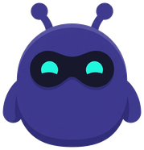

<p align="center">
  
</p>

<h1 align="center">🛸 ClawCode</h1>

<p align="center">
  <strong>Persistent agents for Claude Code — memory, dreaming, and personality.</strong>
</p>

<p align="center">
  <a href="https://github.com/crisandrews/ClawCode/releases"></a>
  <a href="https://github.com/crisandrews/ClawCode/stargazers"></a>
  <a href="LICENSE"></a>
  
  
</p>

<p align="center">
  <a href="#quick-setup">Quick Setup</a> ·
  <a href="#features">Features</a> ·
  <a href="#skills">Skills</a> ·
  <a href="#going-further">Going further</a> ·
  <a href="#troubleshooting">Troubleshooting</a> ·
  <a href="https://github.com/crisandrews/ClawCode/issues">Issues</a>
</p>

---

Claude Code is stateless by default. Every session starts from zero — no memory of who you are, what you talked about, or how the agent should behave.

ClawCode turns Claude Code into a stateful autonomous agent. It gives Claude a persistent identity, searchable memory with bilingual recall, nightly dreaming that consolidates important memories, and a terse conversational style. The agent remembers your dog's name, warns you about allergies before suggesting food, and responds in 1–2 lines instead of paragraphs.

## [Highlights](#highlights)

- **[Persistent identity](#how-it-works)** — name, personality, emoji. The agent wakes up as itself on every session via lifecycle hooks that inject SOUL.md + IDENTITY.md at startup.
- **[Active memory](#memory)** — bilingual recall (ES ↔ EN) at the start of every turn. Ask "cómo se llama mi perro?" and it finds "Cookie" from English notes. Warns about allergies before suggesting food.
- **[Lifecycle hooks](#hooks)** — SessionStart injects identity + auto-creates crons. PreCompact flushes memory before context compression. Stop writes session summaries. SessionEnd tracks dream events.
- **[Dreaming](#dreaming)** — nightly 3-phase consolidation (Light → REM → Deep) with 6 weighted signals. Promotes important memories to long-term storage.
- **[Language adaptation](#how-it-works)** — detects the user's language and responds in kind. Switch mid-conversation and the agent switches too. Commands, status cards, and errors all adapt.
- **[Voice](#voice)** — TTS via sag, ElevenLabs, OpenAI, macOS `say`. STT via local Whisper or OpenAI API.
- **[WebChat](#webchat)** — browser chat UI with SSE real-time delivery. Conversation logs in JSONL + Markdown (same format as WhatsApp).
- **[Messaging channels](#messaging-channels)** — WhatsApp, Telegram, Discord, iMessage, Slack via MCP plugins. No conflicts.
- **[Slash commands everywhere](#messaging-channels)** — `/status`, `/help`, `/whoami`, `/new`, `/compact` work from CLI, WhatsApp, Telegram, Discord — same commands, formatting adapts per platform.
- **[Smart import](#importing-agents)** — 3-tier classifier (GREEN/YELLOW/RED) for skills and crons. Step-by-step wizard with clickable options. Skipped items go to a backlog with recovery notes.
- **[Community skills](#community-skills)** — install from GitHub with `owner/repo@branch#subdir`. OS + dependency validation.
- **[Always-on](#always-on-service)** — launchd / systemd service. Enables dreaming + heartbeat 24/7.
- **[Webhooks](#webhooks)** — external systems (Cloudflare Workers, GitHub Actions, CI/CD, IoT) can POST events to the agent via HTTP. The agent processes them like any other message.
- **[Doctor](#diagnostics)** — 9 health checks (config, identity, memory, SQLite, QMD, bootstrap, HTTP, messaging, dreaming). `--fix` auto-repairs safe issues.
- **[Terse by design](#how-it-works)** — the agent acts, doesn't narrate. Confirmations in 1-2 lines, no preambles, no recaps.

## [Prerequisites](#prerequisites)

- [Node.js](https://nodejs.org/) v18+

## [Quick Setup](#quick-setup)

**1. Create a folder for your agent.**

Each agent lives in its own folder. Create one and open Claude Code there:

```sh
mkdir ~/my-agent && cd ~/my-agent
claude
```

**2. Install the plugin.**

Inside Claude Code, add the marketplace:

```
/plugin marketplace add crisandrews/ClawCode
```

Then install the plugin:

```
/plugin install agent@clawcode
```

When prompted for scope, select **"Install for you, in this repo only (local scope)"** — this keeps the agent isolated to this folder.

Then reload plugins so the skills become available:

```
/reload-plugins
```

**3. Create your agent:**

```
/agent:create
```

This starts the bootstrap ritual — a casual conversation where the agent discovers its name, personality, and emoji. You can also import an existing agent instead:

```
/agent:import
```

**4. Reload to apply the personality:**

```
/mcp
```

The agent now wakes up with its identity on every session.

## [How it works](#how-it-works)

ClawCode injects personality and behavior at four points in the session lifecycle:

| Hook | When | What happens |
| --- | --- | --- |
| **SessionStart** | Session opens | Reads SOUL.md + IDENTITY.md + USER.md and injects them as context. Checks if heartbeat + dreaming crons exist — creates them if missing. |
| **PreCompact** | Context getting full | Reminds agent to save important facts to `memory/YYYY-MM-DD.md` before compression erases them. |
| **Stop** | Session closing | Reminds agent to write a session summary (what was discussed, decisions, open items). |
| **SessionEnd** | Session closed | Logs a `session.end` event for the dreaming system. |

This means:
- **Every session starts with personality** — the agent never says "I'm Claude." It knows its name, vibe, and your info.
- **Memory survives compaction** — PreCompact flushes facts before they're lost.
- **Sessions are summarized** — the next session knows what happened in the last one.
- **Dreaming tracks sessions** — knows when you were active, when you paused.

The agent also **detects your language** from each message and responds in kind. Switch from Spanish to English mid-conversation — the agent switches too. Status cards, error messages, and commands all adapt.

Full details: [`docs/hooks.md`](docs/hooks.md)

## [Features](#features)

### [Memory](#memory)

The agent writes to `memory/YYYY-MM-DD.md` during sessions and searches it automatically at the start of every turn — no need to say "search memory." Bilingual (Spanish ↔ English, 40+ synonym pairs), date-aware ("hoy" resolves to today's date), and safety-critical (warns about allergies before suggesting food). Trivial messages (greetings, "ok", slash commands) skip the search — no wasted context.

Two backends: **builtin** (SQLite + FTS5, works out of the box) and **QMD** (local embeddings for semantic search — install with `bun install -g qmd`).

Full details: [`docs/memory.md`](docs/memory.md) · [`docs/memory-context.md`](docs/memory-context.md) · [`docs/qmd.md`](docs/qmd.md)

### [Dreaming](#dreaming)

Nightly cron (3 AM) runs 3-phase memory consolidation:

- **Light** — ingests recall signals from the day, deduplicates candidates
- **REM** — extracts recurring themes, identifies multi-day patterns, writes reflections to `DREAMS.md`
- **Deep** — ranks candidates with 6 weighted signals (relevance 0.30, frequency 0.24, query diversity 0.15, recency 0.15, consolidation 0.10, conceptual richness 0.06) and promotes winners to `memory/MEMORY.md`

Run manually: `dream(action='run')` or preview with `dream(action='dry-run')`.

Full details: [`docs/dreaming.md`](docs/dreaming.md)

### [Voice](#voice)

TTS via sag, ElevenLabs, OpenAI, or macOS `say`. STT via local Whisper or OpenAI Whisper API. The agent auto-selects the best available backend. Enable with `agent_config(action='set', key='voice.enabled', value='true')`.

Full details: [`docs/voice.md`](docs/voice.md)

### [WebChat](#webchat)

Browser-based chat UI with real-time SSE delivery. Enable the HTTP bridge, open `http://localhost:18790`. Dark/light mode, conversation logging in JSONL + Markdown (same format as WhatsApp plugin).

```
agent_config(action='set', key='http.enabled', value='true')
/mcp
```

Full details: [`docs/webchat.md`](docs/webchat.md) · [`docs/http-bridge.md`](docs/http-bridge.md)

### [Messaging channels](#messaging-channels)

Reach your agent from WhatsApp, Telegram, Discord, iMessage, or Slack. Each messaging plugin is an independent MCP server — no conflicts with ClawCode.

```
/agent:messaging
```

Slash commands work from any channel — `/status`, `/help`, `/whoami`, `/new`, `/compact` all respond whether the user is in the CLI terminal or chatting via WhatsApp. Formatting adapts automatically (`*bold*` for WhatsApp, `**bold**` for Telegram, standard markdown for CLI).

Full details: [`docs/channels.md`](docs/channels.md)

### [Importing agents](#importing-agents)

`/agent:import` brings an existing agent into Claude Code with a step-by-step wizard (clickable options, one question at a time):

1. **Bootstrap files** — copies SOUL.md, IDENTITY.md, USER.md, AGENTS.md, TOOLS.md, HEARTBEAT.md
2. **Memory** — imports MEMORY.md + recent daily logs (credentials are never copied)
3. **Memory backend** — asks: QMD (semantic search) or builtin (SQLite + FTS5)?
4. **Skills** — classifies each skill as GREEN (portable), YELLOW (needs adaptation), or RED (incompatible). You choose: all, specific ones, or skip.
5. **Crons** — same 3-tier classification for scheduled tasks. Prompts are adapted for Claude Code tools.
6. **Messaging** — offers WhatsApp, Telegram, Discord, iMessage setup.

Files are copied **clean** — no annotations, no comments. Adaptation details go to `IMPORT_BACKLOG.md` so the user can revisit skipped items later. The import event is logged to memory so the agent remembers what was imported.

### [Webhooks](#webhooks)

External systems can send events to the agent via `POST /v1/webhook` (requires HTTP bridge enabled). The agent queues them and processes on the next turn.

Use cases:
- **[Email catch-all](docs/webhooks.md#cloudflare-email-worker--real-time-email-catch-all)** — Cloudflare Email Worker forwards every incoming email to the agent in real-time
- **[Gmail push](docs/webhooks.md#gmail--real-time-push-notifications)** — Gmail notifies the agent via Pub/Sub when new emails arrive
- **[CI/CD](docs/webhooks.md#cicd-github-actions)** — GitHub Actions sends build results → agent summarizes and notifies via WhatsApp
- **[Scheduled tasks](docs/webhooks.md#cloudflare-worker--scheduled-tasks)** — Cloudflare Workers trigger agent actions on a cron schedule
- **Monitoring** — uptime checker sends alert → agent investigates and reports
- **IoT** — sensor data arrives → agent logs to memory and acts on thresholds

```sh
curl -X POST http://localhost:18790/v1/webhook \
  -H "Content-Type: application/json" \
  -H "Authorization: Bearer your-token" \
  -d '{"event": "deploy", "status": "success", "repo": "my-app"}'
```

**Security:** when the bridge is exposed to the network (`host: "0.0.0.0"`), a token is **required** — the bridge refuses to start without one.

Queue holds up to 1000 events. Drain with `GET /v1/webhooks` or the `chat_inbox_read` MCP tool.

Full details: [`docs/http-bridge.md`](docs/http-bridge.md)

### [Diagnostics](#diagnostics)

`/agent:doctor` runs 11 health checks: config validity, identity files, memory directory, SQLite integrity, QMD availability, bootstrap state, HTTP bridge, messaging plugins, dreaming, cron registry, jq availability. Returns a ✅/⚠️/❌ card. Use `--fix` to auto-repair safe issues (create missing `memory/`, reindex SQLite, remove stale `BOOTSTRAP.md`).

Full details: [`docs/doctor.md`](docs/doctor.md)

### [Cron persistence](#cron-persistence)

Reminders (heartbeat, dreaming, imports, and ad-hoc "remind me in 2h") survive session closes. ClawCode maintains a registry at `memory/crons.json` and reconciles it against the live harness on every SessionStart: anything missing gets recreated, anything live-but-unknown gets adopted. PostToolUse captures ad-hoc `CronCreate`/`CronDelete` automatically — you don't need a special command for "remind me".

Manage reminders through `/agent:crons` (aliases `/agent:reminders`, `list reminders`, `recordatorios`):

```
/agent:crons list                       # ✅⚠️⏸ status table
/agent:crons add "0 9 * * *" "email"    # add a reminder
/agent:crons delete 3                   # remove with AskUserQuestion confirm
/agent:crons pause heartbeat-default    # pause without deleting
/agent:crons reconcile                  # force sync
/agent:crons import                     # bring OpenClaw crons into the registry
```

Full details: [`docs/crons.md`](docs/crons.md)

## [Skills](#skills)

| Skill | Description |
| --- | --- |
| `/agent:create` | Create a new agent with bootstrap ritual |
| `/agent:import [id]` | Import an existing agent (personality + memory + skills + crons) |
| `/agent:doctor [--fix]` | Diagnose agent health. `--fix` applies safe auto-repairs |
| `/agent:settings` | View/modify agent config (guided) |
| `/agent:skill install\|list\|remove` | Install community skills from GitHub |
| `/agent:channels` | Messaging channel status and launch command |
| `/agent:service install\|status\|uninstall\|logs` | Always-on background service |
| `/agent:voice status\|setup` | TTS / STT backends |
| `/agent:messaging` | Set up WhatsApp, Telegram, Discord, iMessage, Slack |
| `/agent:crons` / `/agent:reminders` | Manage reminders: list, add, delete, pause, reconcile, import |
| `/agent:heartbeat` | Memory consolidation and periodic checks |
| `/agent:status` | Agent status dashboard |
| `/agent:usage` | Resource usage |
| `/agent:new` | Save session and prepare for `/clear` |
| `/agent:compact` | Save context before compression |
| `/whoami` | Sender info and agent identity |
| `/help` | List all available commands (dynamic) |

## [Going further](#going-further)

### [Community skills](#community-skills)

Install skills from GitHub:

```
/agent:skill install alice/pomodoro
/agent:skill install alice/skills@main#weather
/agent:skill list
/agent:skill remove pomodoro
```

Full details: [`docs/skill-manager.md`](docs/skill-manager.md)

### [Always-on service](#always-on-service)

Run the agent as a background service (launchd on macOS, systemd on Linux):

```
/agent:service install
/agent:service status
/agent:service logs
```

Full details: [`docs/service.md`](docs/service.md)

Optional companion: [`docs/watchdog.md`](docs/watchdog.md) — opt-in external health probe + auto-restart for always-on services.

### [Configuration](#configuration)

All settings in `agent-config.json`. Edit directly or use `agent_config`:

```
agent_config(action='get')
agent_config(action='set', key='memory.backend', value='qmd')
```

Non-critical settings apply live. Critical settings need `/mcp` — the agent tells you which.

Full details: [`docs/config-reload.md`](docs/config-reload.md)

## [Updating, uninstalling, and cache](#updating-uninstalling-and-cache)

**Update to the latest version:**

```
/plugin marketplace update crisandrews/ClawCode
/plugin update agent@clawcode
/reload-plugins
```

If `/plugin update` says "already at latest version" but you know there's a new one, use the manual method: type `/plugin`, find `agent@clawcode` in the list, press Enter, and select **Update**.

Your personality, memory, skills, and config are preserved — only the plugin code updates. No data loss.

**Uninstall:**

```
/plugin uninstall agent@clawcode
```

Your agent files (SOUL.md, IDENTITY.md, memory/, skills/) stay in the folder — they're yours. Only the plugin code is removed.

**Clear cache (if reinstall fails or behaves unexpectedly):**

Close Claude, then in terminal:

```sh
rm -rf ~/.claude/plugins/cache/clawcode
```

Reopen Claude and install again.

### [Multiple agents](#multiple-agents)

Each agent is its own folder with its own personality, memory, and config:

```
~/agent-work/      ← Agent #1
~/agent-personal/  ← Agent #2
```

Install the plugin in each folder with local scope. Switch: `cd ~/other-agent && claude`.

## [Personality files](#personality-files)

Every agent has these files in its root. They're injected as context at session start via the SessionStart hook.

| File | What it defines |
| --- | --- |
| `SOUL.md` | Core truths, boundaries, philosophy — the agent's deepest identity |
| `IDENTITY.md` | Name, emoji, creature type, vibe, birth date |
| `USER.md` | Your info: name, timezone, language, preferences |
| `AGENTS.md` | Operational rules, safety boundaries, local skill triggers |
| `TOOLS.md` | Platform-specific formatting (WhatsApp uses `*bold*`, Telegram uses `**bold**`) |
| `HEARTBEAT.md` | What to check every 30 min (review daily logs, consolidate memory) |
| `BOOTSTRAP.md` | First-run ritual (deleted after onboarding) |

The agent never says "I'm Claude" — it uses its name from IDENTITY.md. Even when asked directly "are you Claude?", it answers: "I'm [name] — built on Claude, but with my own memory, personality, and name."

## [Session & data](#session--data)

```
~/my-agent/
├── SOUL.md, IDENTITY.md, USER.md     # Agent personality
├── AGENTS.md, TOOLS.md, HEARTBEAT.md # Behavioral rules
├── agent-config.json                 # Settings
├── memory/
│   ├── MEMORY.md                     # Long-term curated memory
│   ├── YYYY-MM-DD.md                 # Daily logs (append-only)
│   ├── .memory.sqlite                # Search index (auto-generated)
│   └── .dreams/                      # Dream tracking data
├── .webchat/logs/conversations/      # WebChat logs (JSONL + MD)
├── skills/                           # Installed + imported skills
└── IMPORT_BACKLOG.md                 # Skipped import items (if any)
```

**Conversation logs** are stored in two formats per channel:
- **JSONL** — one JSON object per line, ideal for programmatic access and memory indexing
- **Markdown** — human-readable chat transcript

## [Troubleshooting](#troubleshooting)

Run `/agent:doctor` first — it checks everything in one shot. Add `--fix` to auto-repair safe issues.

- **"Failed to reconnect to plugin:agent:clawcode"** — Dependencies didn't install. Check Node.js v18+ (`node --version`). Then try manually: close Claude, run `cd ~/.claude/plugins/cache/clawcode/agent/*/  && npm install`, reopen Claude.
- **Agent has no personality** — Run `/mcp` to reload. The SessionStart hook injects identity from SOUL.md + IDENTITY.md.
- **Memory search returns nothing** — Index builds on first search. For QMD: `agent_config(action='set', key='memory.backend', value='qmd')`.
- **Agent doesn't remember things** — The active memory reflex uses bilingual synonyms but not everything. Try different keywords.
- **Config change didn't take effect** — Non-critical settings apply live. Critical ones need `/mcp`. The agent tells you which.
- **Messaging channels** — Run `/agent:channels status` for installed/authenticated/active status.
- **Crons don't persist across restarts** — Known limitation: `durable: true` is currently session-only in Claude Code. Crons are recreated automatically at each session start via the SessionStart hook (default heartbeat + dreaming). For 24/7, use `/agent:service install`.

## [Important](#important)

- **Crons only run while Claude Code is open** — for 24/7, use `/agent:service install`.
- **WebChat + WhatsApp logs** are indexable via `memory.extraPaths` in config.
- **Each agent folder is fully self-contained** — portable, backupable, deletable.

## [Further reading](#further-reading)

Per-feature documentation in [`docs/`](docs/INDEX.md).

## [Disclaimer](#disclaimer)

ClawCode is an independent, open-source project. Claude is a trademark of Anthropic, PBC. ClawCode is not affiliated with or endorsed by Anthropic.
